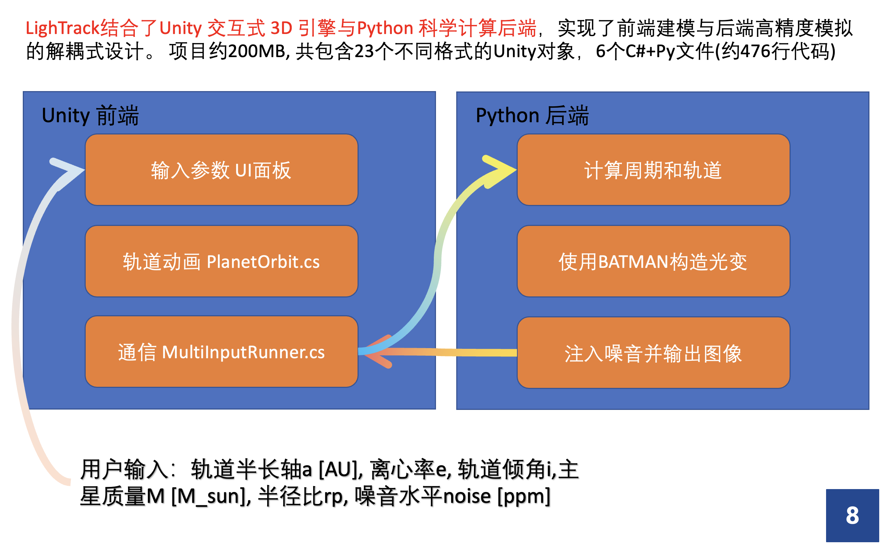
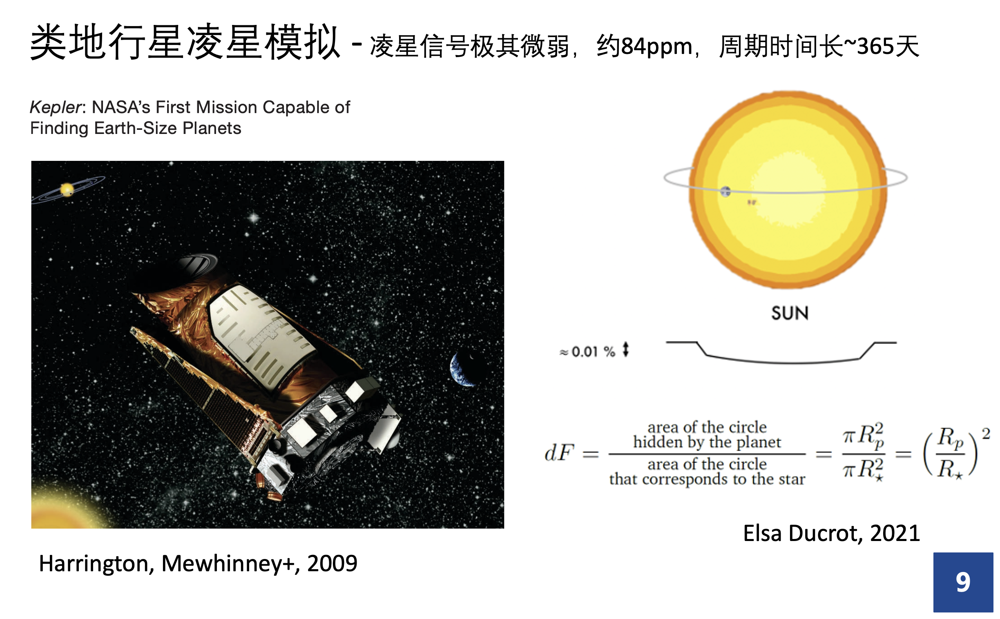
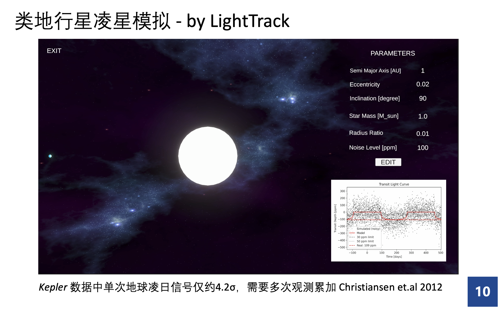
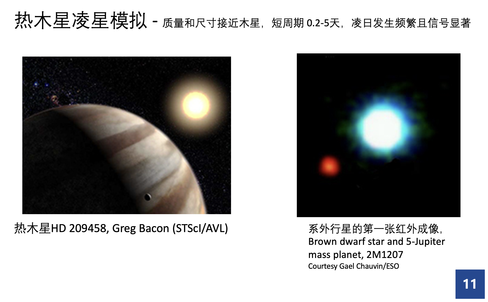
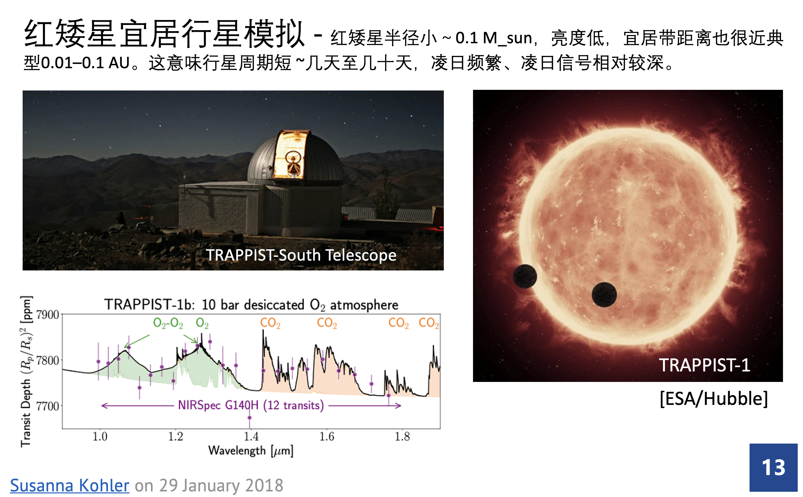
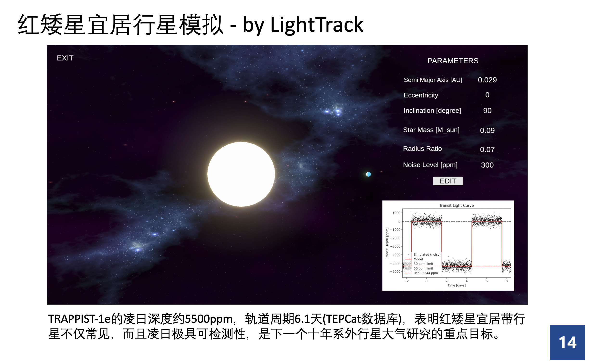
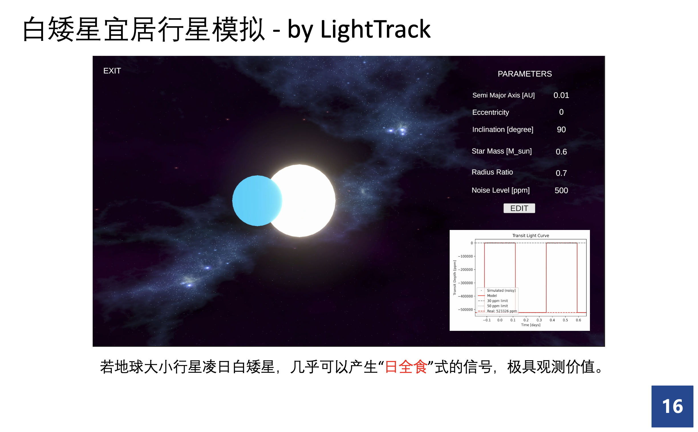
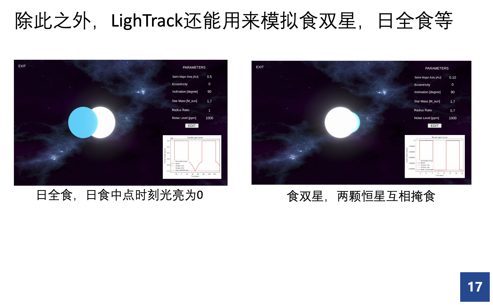
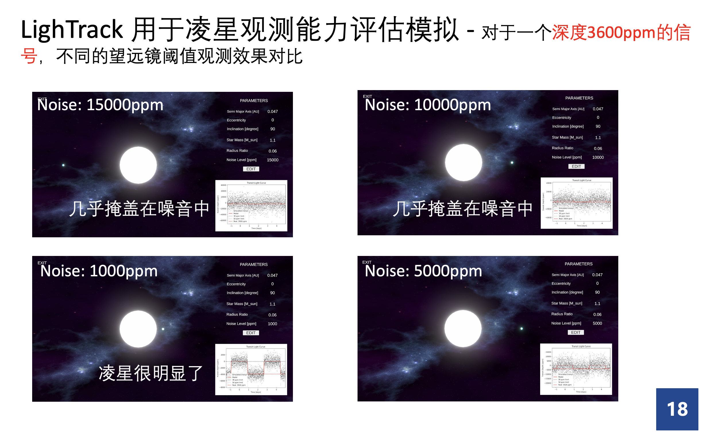
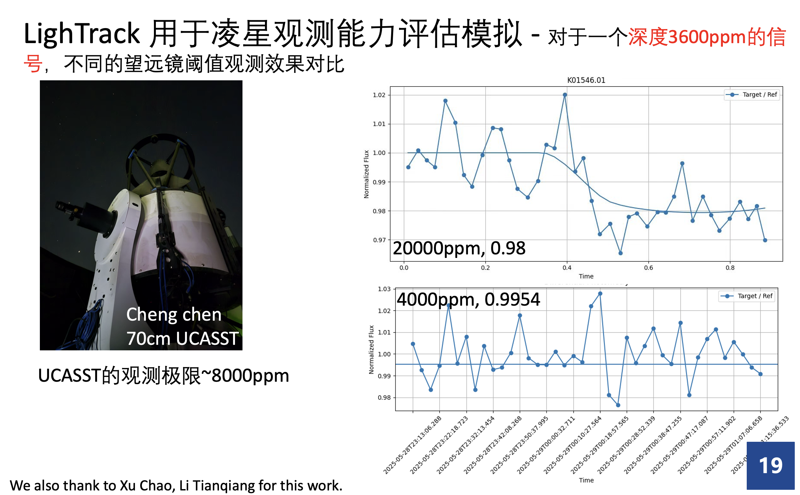

# 🌌 LighTrack: An Interactive Exoplanet Transit Simulator

> “See the unseen. Model the unimaginable.”  
> —— 以交互方式洞察遥远行星的凌日轨迹与光变奥秘。

---

## 📘 项目简介 | Project Overview

**LighTrack** 是一个将 **科学计算** 与 **三维可视化** 相结合的开源模拟平台，旨在通过参数化输入快速模拟不同类型的系外行星凌日信号，生成其对应的光变曲线，并以 3D 方式动态演示行星轨道。

它位于科研级模拟（如 BATMAN/PHOEBE）与教学展示软件（如 WWT/NASA Eyes）之间，填补了中间层空白。  
既适合**科研人员**进行参数调优和观测规划，也适合**教师与学生**用于直观的演示与学习。

---

## 🎯 研究动机 | Motivation

随着 Kepler、TESS 等望远镜的推进，**凌星法**成为寻找系外行星的黄金工具。但要理解凌星光变如何产生、模拟不同系统的行为、训练 AI 进行自动识别，现有工具面临两大痛点：

- 📉 **科研建模工具难上手**：参数复杂、接口繁琐、需大量代码；
- 🪞 **可视化平台难扩展**：仅展示已知系统，无法自定义模拟。

于是，我们开发了 LighTrack ——  
> 用简洁的 UI 输入参数，实时生成轨道动画与光变曲线，  
> 一切都在你眼前发生。

---

## 🧠 软件架构 | System Architecture



LighTrack 采用 **前后端解耦式设计**，将模拟与渲染功能分离，保证高效运行与良好拓展性。

### 🎮 Unity 前端
- `PlanetOrbit.cs`：行星运动轨迹动态绘制
- `MultiInputRunner.cs`：参数读取与 Python 通信
- 参数输入 UI：支持设置包括轨道半长轴、离心率、轨道倾角等关键物理量

### 🧪 Python 后端
- `simulate_transit.py`：基于 BATMAN 物理模型，生成光变曲线
- 支持添加不同水平的白噪声，生成模拟观测数据
- 输出图像格式支持 PNG / PDF，可轻松集成到文献、教学课件中

---

## 🧪 输入参数详解

| 参数名 | 单位 | 说明 |
|--------|------|------|
| `a` | AU | 行星轨道半长轴 |
| `e` | – | 离心率 |
| `i` | deg | 轨道倾角 |
| `M_star` | M_sun | 主星质量（以太阳质量计） |
| `rp` | – | 行星与恒星半径比 \( R_p / R_*\) |
| `noise` | ppm | 噪音注入水平，用于模拟望远镜灵敏度 |

---

## 🌌 科学场景模拟 | Scientific Use Cases

### 🌍 类地行星（Earth-like）
- 周期长（~365天），凌星深度浅（~84 ppm）
- 凌星信号极其微弱，约84ppm，周期时间长~365天
- 需要长期监测与多次叠加
- 示意：Kepler 中类地凌星信号仅 4.2σ



#### 🎥 类地行星视频演示
[📽️ 点击此处下载或观看视频](类地行星.mp4)




### 🔥 热木星（Hot Jupiter）
- 短周期（1-5天），深度高（可达上万 ppm）
- 质量和尺寸接近木星，短周期 0.2-5天，凌日发生频繁且信号显著
- 最早发现的凌星类系外行星，信号显著
- 示意：HD 209458b 是首批确认的热木星之一




#### 🎥 热木星视频演示
[📽️ 点击此处下载或观看视频](热木星.mp4)


### 🛸 红矮星宜居行星（TRAPPIST-1 系统）
- 主星小而暗，行星靠近
- 周期短（数日至十几天）、信号深（几千 ppm）
- 示意：TRAPPIST-1e 周期 6.1 天，深度达 5500 ppm！
- 红矮星半径小～0.1 M_sun，亮度低，宜居带距离也很近典型0.01–0.1 AU。这意味行星周期短 ~几天至几十天，凌日频繁、凌日信号相对较深。



  
#### 🎥 红矮星宜居行星视频演示
[📽️ 点击此处下载或观看视频](红矮星.mp4)




### ⚪ 白矮星凌星（WD Systems）
- 行星几乎贴脸凌日，“遮挡程度堪比日全食”
- 凌星持续数分钟，亮度骤降超 50%
- 示意：WD 1856+534 b 每 34 小时一次凌星，下降 56%！
- 白矮星是太阳类恒星演化末期形成的小而致密星体，其宜居带非常靠近，行星公转周期只有数十小时到几天，地球大小的行星凌星可造成极深的光变。


#### 🎥 白矮星宜居行星视频演示
[📽️ 点击此处下载或观看视频](白矮星周边.mp4)



### 🌑 掩食双星模拟
- 模拟两颗恒星互掩、产生周期性亮度变化
- 可重现经典日全食或食双星的光变




#### 🎥 日全食视频演示
[📽️ 点击此处下载或观看视频](日全食.mp4)

#### 🎥 食双星视频演示
[📽️ 点击此处下载或观看视频](食双星.mp4)


---

## 🔭 观测极限模拟 | Detection Threshold Demo

通过设定不同的噪声水平（1000–20000 ppm），LighTrack 可模拟望远镜探测能力对凌星信号的影响。



示例：

| 噪声水平 | 可识别性 |
|----------|----------|
| 1000 ppm | ⭐⭐⭐⭐⭐（清晰可辨） |
| 5000 ppm | ⭐⭐⭐（需叠加观测） |
| 15000 ppm | ⭐（几乎被噪音淹没） |

> UCASST 70cm 实验望远镜探测极限约为 **8000 ppm**




---

## 🖥️ 文件结构 | File Structure

```
LighTrack/
├── unity_frontend/             # Unity项目文件夹
│   ├── Scripts/
│   │   ├── PlanetOrbit.cs
│   │   └── MultiInputRunner.cs
│   └── Scenes/
│       └── Main.unity
├── python_backend/
│   └── simulate_transit.py     # BATMAN光变模拟
├── data/
│   └── sample_output.png
├── README.md
└── LICENSE
```

---

## 📥 安装与使用 | Installation & Usage

### ✅ 环境准备

**Unity 环境：**
- Unity 2021 或以上版本，支持 URP

**Python 环境：**
- Python 3.9+
- 安装依赖：
```bash
pip install batman-package numpy matplotlib
```

### 🚀 运行步骤

1. 打开 Unity 项目，运行主场景
2. 输入物理参数（支持快捷设置热木星/地球等）
3. 点击“生成”按钮
4. Python 脚本自动计算光变并将图像返回前端
5. 前端展示轨道动画 + 凌星曲线

---

## 👨‍👩‍👦 团队与贡献 | Team & Contribution

| 成员 | 分工 |
|------|------|
| **刘擎天** | Python 后端建模 + 科学分析  |
| **陈程** | Unity 前端实现 + GitHub 仓库发布 |
| **王瑞** | 三维模型构建 + 参数图形映射 + 文档撰写 |

我们也特别感谢：徐超、李天强提供调试建议与设备支持！

---

## 📚 参考资料 | References
1. Christiansen J. L., Jenkins J. M., Caldwell D. A., et al. Measuring Transit Signal Recovery in the Kepler Pipeline II: Detection Efficiency as Calculated in One Year of Data[J]. The Astrophysical Journal Supplement Series, 2012, 200(2): 12.

2. Harrington J., Luszcz S., Seager S., et al. The Phase-dependent Infrared Brightness of the Extrasolar Planet υ Andromedae b[J]. Nature, 2006, 447: 691–693.

3. Ducrot E., Gillon M., Delrez L., et al. Secondary Eclipse Depths of the TRAPPIST-1 Planets with Spitzer[J]. Astronomy & Astrophysics, 2021, 646: A152.

4. Alonso R., Brown T. M., Torres G., et al. Transiting “Hot Jupiter” Planet OGLE-TR-56b: No Timing Variations and Refined Parameters[J]. The Astrophysical Journal Letters, 2004, 613(2): L153–L156.

5. Vanderburg A., Rappaport S., Xu S., et al. A Giant Planet Candidate Transiting a White Dwarf[J]. Nature, 2020, 585: 363–367.

6. Whyte L., McCaughrean M. J., Maxted P. F. L., et al. Potential for Life to Exist and be Detected on Earth-like Planets Orbiting White Dwarfs[J]. The Astrophysical Journal Letters, 2024, 947(1): L10.

7. TEPCat: The Transiting Extrasolar Planet Catalogue [DB/OL]. Available: http://www.astro.keele.ac.uk/jkt/tepcat/

8. NASA Eyes on Exoplanets [EB/OL]. https://eyes.nasa.gov/apps/exo/#/

9. Kreidberg L. BATMAN: BAsic Transit Model cAlculatioN in Python [J]. Publications of the Astronomical Society of the Pacific, 2015, 127(957): 1161–1165.

10. Prša A., Zwitter T. PHOEBE: Model of Eclipsing Binary Stars for the Whole Community [J]. The Astrophysical Journal, 2005, 628(1): 426–438.

11. Maxted P. F. L. ELLC: A Fast, Flexible Light Curve Model for Eclipsing Binary Stars and Transiting Planets[J]. Astronomy & Astrophysics, 2016, 591: A111.

---

## 📮 联系我们 | Contact Us

欢迎你通过以下方式参与、提出改进建议或报告问题：

- GitHub Issues
- Pull Requests
- 邮件联系：qtxplorer@gmail.com, cc_0628@outlook.com

---

> “LighTrack 不是天文模拟的终点，而是探索宇宙的起点。” 🚀
